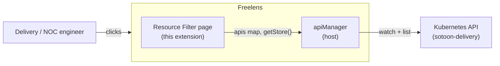
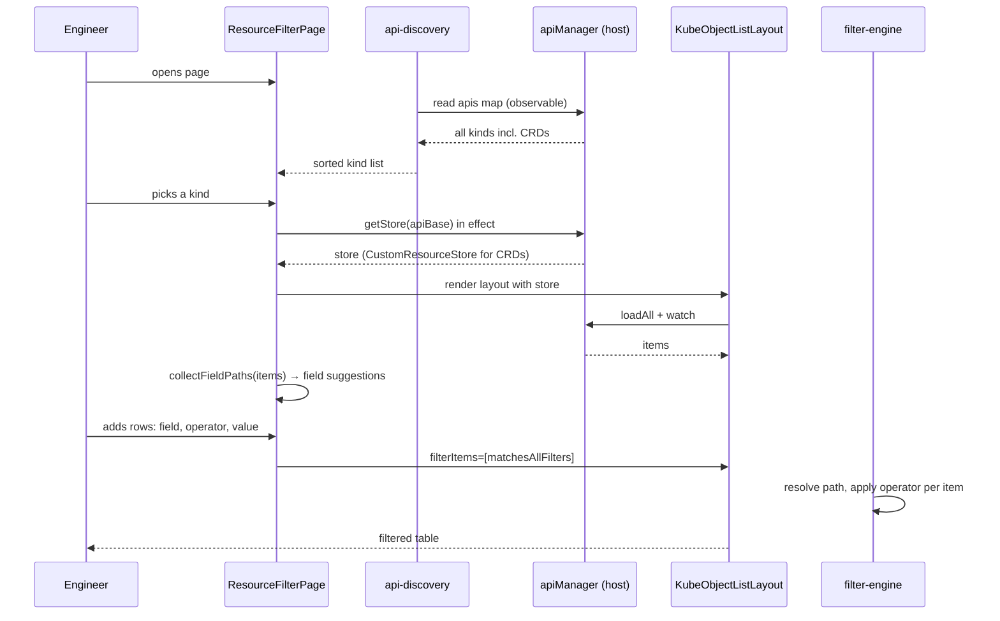

# Architecture — freelens-resource-filter-extension

## Components

- `src/renderer/index.tsx` — registers one cluster page (`resource-filter`) and its sidebar menu entry. The menu uses `orderNumber: 15`, right below the built-in "Cluster" item.
- `src/renderer/components/resource-filter-page.tsx` — the page. Kind picker, filter bar, and a generic `KubeObjectListLayout` for the selected kind.
- `src/renderer/components/filter-bar.tsx` — filter rows. Field select, operator select, value input with suggestions.
- `src/renderer/filtering/filter-store.ts` — MobX observable state for the active rows. One instance per page visit.
- `src/renderer/filtering/filter-engine.ts` — pure logic. Field-path resolution and operator semantics.
- `src/renderer/filtering/field-paths.ts` — walks loaded items and collects field paths plus distinct values.
- `src/renderer/discovery/api-discovery.ts` — enumerates resource kinds from `Renderer.K8sApi.apiManager`.
- `src/main/index.ts` — empty stub. The extension uses no main-process features.
- `electron.vite.config.js` + `build/global-externals.js` — the build. Renderer entry under the `preload` key, CommonJS, `preserveModules`.

## System context

## Key invariants

- Built-in resource pages are never modified. The extension renders only its own cluster page. Freelens exposes no hook to inject filters into built-in lists.
- Host modules stay external. `@freelensapp/extensions`, `react`, `react-dom`, `mobx`, `mobx-react`, and `react-router-dom` resolve to host globals at runtime through `build/global-externals.js`.
- Output stays CommonJS with `preserveModules`. Freelens requires `out/main/index.js` and `out/renderer/index.js`.
- `apiManager.getStore(apiBase)` lazily creates a `CustomResourceStore` for CRDs. It mutates host state, so the page resolves stores in an effect, never during render.
- The field catalog derives from live items. Empty items mean an empty field dropdown. The catalog recomputes when the item count or load state changes, because the observable array's identity never changes.
- Filters are pure and ANDed. An empty value disables a row. `exists` and `!exists` ignore the value.

## Primary flow

