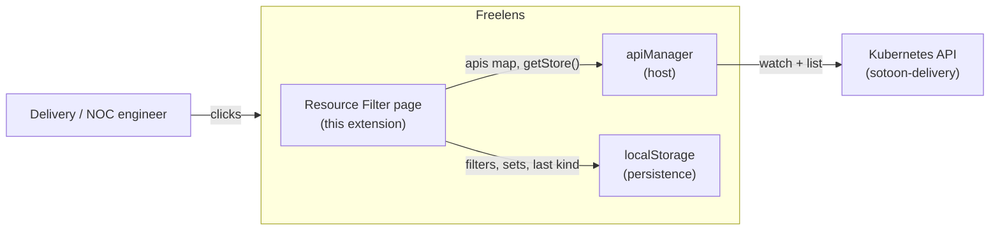

# Architecture — freelens-resource-filter-extension

## Components

- `src/renderer/index.tsx` — registers one cluster page (`resource-filter`) and its sidebar menu entry. The menu uses `orderNumber: 15`, right below the built-in "Cluster" item. The page renders inside an `ErrorBoundary`.
- `src/renderer/components/resource-filter-page.tsx` — the page. Kind picker, filter bar, and a generic `KubeObjectListLayout` for the selected kind. Owns persistence wiring and derived columns.
- `src/renderer/components/filter-bar.tsx` — filter rows and saved-set controls. Field select, operator select, value input with suggestions. Marks rows whose field is missing from the current kind.
- `src/renderer/components/error-boundary.tsx` — catches render crashes so the cluster frame stays usable.
- `src/renderer/filtering/filter-store.ts` — MobX observable state for the active rows. Uses `makeObservable` annotations, no decorators.
- `src/renderer/filtering/filter-engine.ts` — pure logic. Field-path resolution, operator semantics, and `createFilterMatcher` (compiles regexes and `in`-lists once per pass).
- `src/renderer/filtering/field-paths.ts` — walks loaded items. Collects field paths, distinct values, and per-path presence; derives the two most common `spec`/`status` columns.
- `src/renderer/filtering/filter-storage.ts` — safe localStorage wrapper. Persists active filters per kind, named filter sets, and the last selected kind.
- `src/renderer/discovery/api-discovery.ts` — enumerates resource kinds from `Renderer.K8sApi.apiManager`.
- `src/main/index.ts` — empty stub. The extension uses no main-process features.
- `electron.vite.config.js` + `build/global-externals.js` — the build. Renderer entry under the `preload` key, CommonJS, `preserveModules`.

## System context



## Key invariants

- Built-in resource pages are never modified. The extension renders only its own cluster page. Freelens exposes no hook to inject filters into built-in lists.
- Host modules stay external. `@freelensapp/extensions`, `react`, `react-dom`, `mobx`, `mobx-react`, and `react-router-dom` resolve to host globals at runtime through `build/global-externals.js`.
- Output stays CommonJS with `preserveModules`. Freelens requires `out/main/index.js` and `out/renderer/index.js`.
- Source compiles under tsc, oxc (build), and esbuild (vitest). That rules out decorators — MobX state uses `makeObservable` annotation maps.
- `apiManager.getStore(apiBase)` lazily creates a `CustomResourceStore` for CRDs. It mutates host state, so the page resolves stores in an effect, never during render.
- The field catalog derives from live items. Empty items mean an empty field dropdown. The catalog recomputes when the item count or load state changes, because the observable array's identity never changes.
- Filters are pure and ANDed. Empty field or empty value disables a row. `exists` and `!exists` ignore the value. Rows whose field is absent from the current kind's catalog are skipped and marked stale.
- Regexes compile once per filter pass, never per item, and values are capped at 10,000 characters before matching.
- Persistence is best-effort. Every localStorage access is guarded; a missing or throwing storage degrades to no persistence.

## Primary flow

```mermaid
sequenceDiagram
    participant U as Engineer
    participant P as ResourceFilterPage
    participant D as api-discovery
    participant AM as apiManager (host)
    participant L as KubeObjectListLayout
    participant FE as filter-engine

    U->>P: opens page
    D->>AM: read apis map (observable)
    AM-->>D: all kinds incl. CRDs
    D-->>P: sorted kind list
    P->>P: restore last kind + saved filters
    U->>P: picks a kind
    P->>AM: getStore(apiBase) in effect
    AM-->>P: store (CustomResourceStore for CRDs)
    P->>L: render layout with store
    L->>AM: loadAll + watch
    AM-->>L: items
    P->>P: collectFieldPaths(items) → suggestions + derived columns
    U->>P: adds rows: field, operator, value
    P->>L: filterItems=[matcher]
    FE->>FE: compile once, resolve path, apply operator per item
    L-->>U: filtered table
